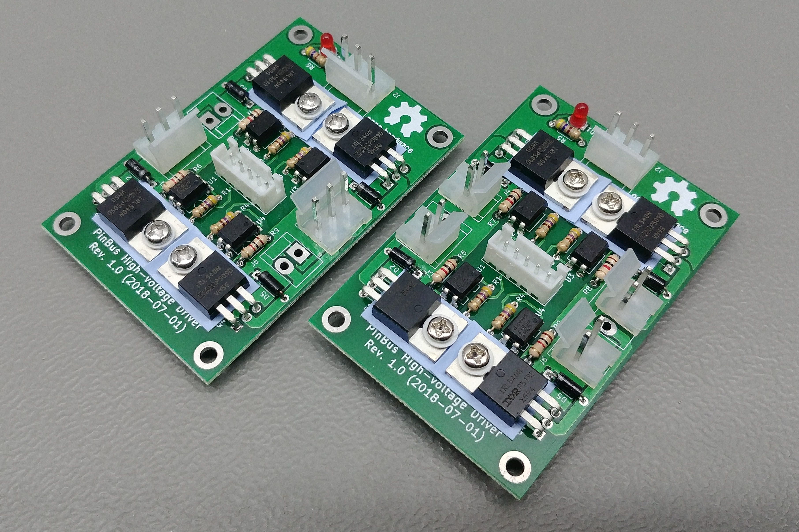

# High Voltage Driver Board - Rev. 1.0

This board has four independant high voltage drivers. These boards were designed to drive pinball machine solenoids, but their use is not limited to pinball machines. These boards can als be used to drive high power LEDs, DC motors, etc... As long as the used [IRL540](assets/irl540.pdf) MOSFETs are able to provide enough power to the device being driven. The MOSFETs are driven by the [PC817](assets/pc817.pdf) opto-couplers, so the digital inputs are isolated from the high-power section.

The outputs can be configured in two ways. Every output can be exposed by a separate 2-pin connector, or two outputs can be joined together into a 3-pin connector. This is useful for flipper solenoids.

Pin 1 (marked by the square footprint) on J1 is the common ground pin. Pin 1 on jumper J2 is +5V, pin 2 is ground, and pin 3 is +25V to max. +75V.

**Warning: These designs are made as part of a hobby project and thus come with no guarantees. Do not use these designs in for any critical systems! Working with voltages higher than +40V can be potentially dangerous, please take appropriate safety measures!**

## BOM

| Identifiers | Quantity | Part |
| ----------- | -------- | ---- |
| D1          |       1x | 5mm red LED |
| D2 - D5     |       4x | 1N4004 compatible diode |
| J1          |       1x | JST XH connector, 2.5mm pitch, 5-way, through-hole |
| J2          |       1x | CH 3.96 connector, 3-way, through hole |
| J3 - J6     |          | CH 3.96 connector, 2x 3-way or 4x 2-way, through-hole |
| Q1 - Q4     |       4x | IRL540 MOSFET |
| R1 - R4     |       4x | 51Ω 0.25W resistor |
| R5          |       1x | 470Ω 0.25W resistor |
| R6 - R9     |       4x | 1kΩ 0.25W resistor |
| U1 - U4     |       4x | PC817 Sharp opto-coupler |

## Pictures

